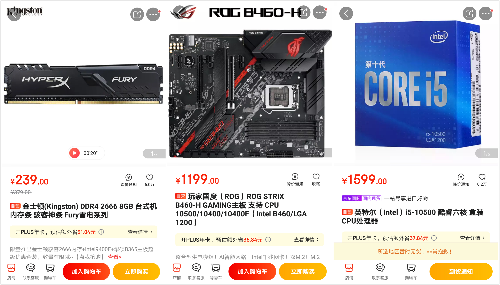
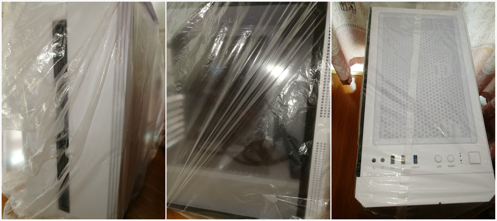

出一台自己组装的99新台式机（7月买的组装的，验机后就封装起来没有使用了）

配置如下

| 配置 | 型号                                          | 京东价（参考） |
| ---- | --------------------------------------------- | -------------- |
| 主板 | 华硕 ROG STRIX B460-H GAMING主板              | 1199           |
| CPU  | 英特尔 i5-10500 酷睿六核 盒装CPU处理器        | 1599           |
| 内存 | 金士顿 DDR4 2666 8G 骇客神条 Fury雷电系列 2条 | 478            |
| 固态 | 西部数据 500GB M.2接口(NVMe协议) SN750        | 599            |
| 电源 | 长城巨龙600W GW-6800 80PLUS金牌 日系电容      | 449            |
| 机箱 | 先马 剑魔3 白色机箱                           | 199            |
| 总计 |                                               | 4523           |

1.赠送一个15cm风扇，一个静音键盘，一根HDMI线。

2.我已经组装好了，省去装机成本。人在江安，面交，可以找网吧或有显示器的地方当场验货（检验硬盘开机时间、查询序列号、CPU-Z、鲁大师测试等）。

3.所有的配置都有包装盒（我自己组装的），一并给你，支持官网验证序列号，另外主板我买过延保绑定过华硕账号，到时候一并给你，一年内损坏可换新。

4.出售价格**4100**元

